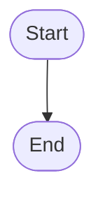
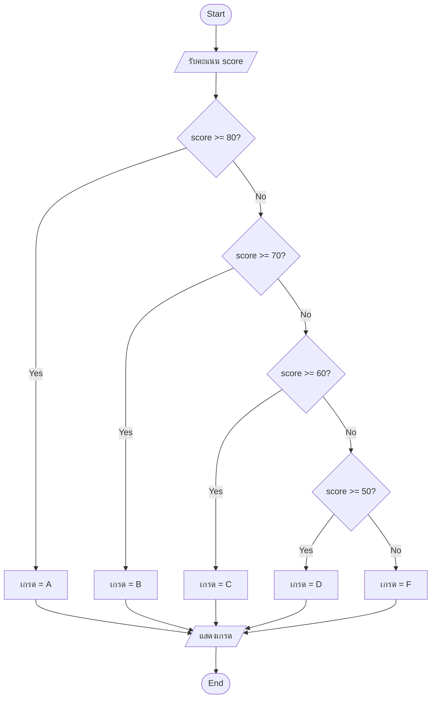
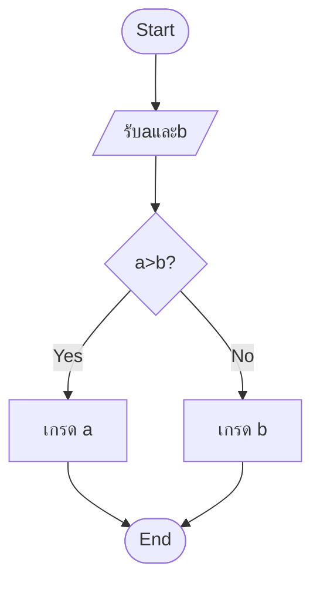
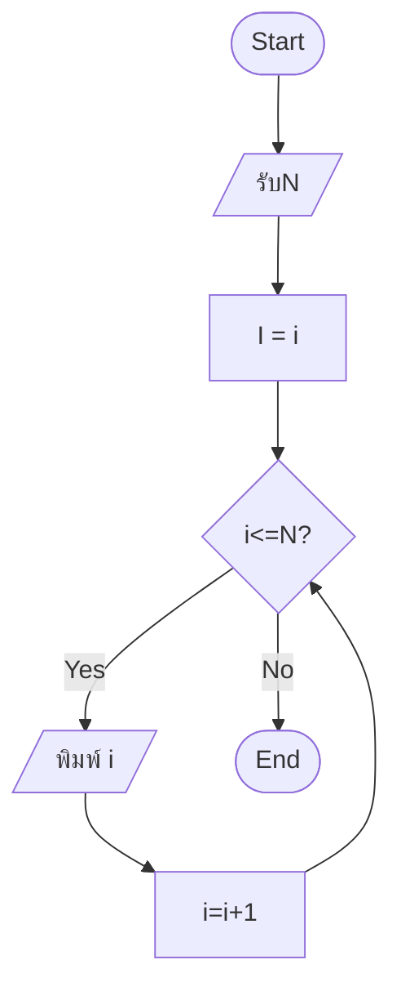

```mermaid
flowchart TD
A([Start]) --> B([End])
```

โจทย์ A — ตรวจสอบเกรด
รับคะแนน 0–100 แล้วแปลงเป็นเกรด A–F

```mermaid
flowchart TD
Start([Start]) --> Input[/รับคะแนน score/]
Input --> D1{score >= 80?}
D1 -->|Yes| A[เกรด = A]
D1 -->|No| D2{score >= 70?}
D2 -->|Yes| B[เกรด = B]
D2 -->|No| D3{score >= 60?}
D3 -->|Yes| C[เกรด = C]
D3 -->|No| D4{score >= 50?}
D4 -->|Yes| D[เกรด = D]
D4 -->|No| F[เกรด = F]
A & B & C & D & F --> Output[/แสดงเกรด/]
Output --> End([End])
```

โจทย์ B — หาค่าสูงสุดจาก 2 ตัวเลข

```mermaid
flowchart TD 
Start([Start]) --> Input[/รับaและb/] 
Input --> D1{a>b?} 
D1 -->|Yes| A[เกรด a] 
D1 -->|No| B[เกรด b] 
A  & B-->End([End])
```

โจทย์ C — นับจาก 1 ถึง N

```mermaid
flowchart TD
Start([Start]) --> Input[/รับN/]
Input -->A[I = i]
A --> A1{i<=N?}
A1 -->|Yes| I[/พิมพ์ i/]
I -->I2[i=i+1]
I2 -->A1
A1 -->|No|End([End])
```
