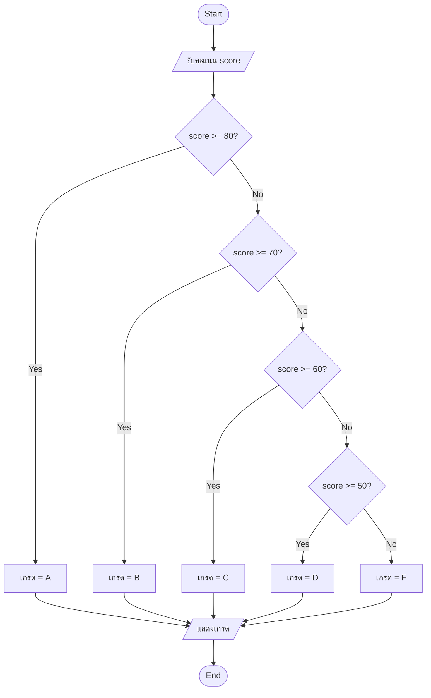
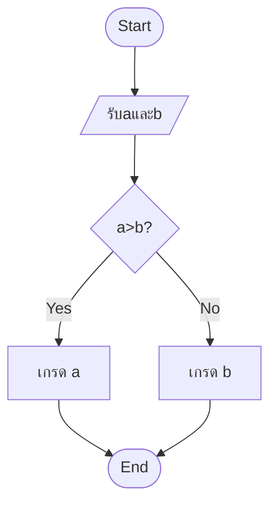
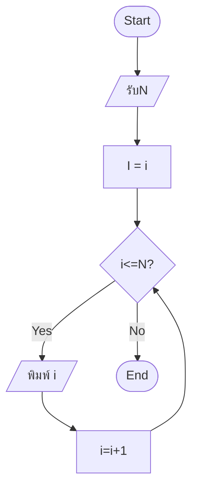

BEGIN [โจทย์ A — ตรวจสอบเกรด]
INPUT score
IF score >= 80 THEN grade = "A"
ELSE IF score >= 70 THEN grade = "B"
ELSE IF score >= 60 THEN grade = "C"
ELSE IF score >= 50 THEN grade = "D"
ELSE grade = "F"
END IF
OUTPUT grade

BEGIN [โจทย์ B — หาค่าสูงสุดจาก 2 ตัวเลข]
INPUT A,B
IF A>B?
ELSE IF GRADE A SHOW A
ELSE IF GRADE B SHOW B

END IF

WHILE A >B DO

print A

END WHILE

OUTPUT grade

BEGIN [โจทย์ C — นับจาก 1 ถึง N]

INPUT n

i=1

FOR i FROM 1 TO i <=N DO

    print 1

    i=i+1

END FOR

WHILE i <=N DO

    print i

    i=i+1

END WHILE

END
